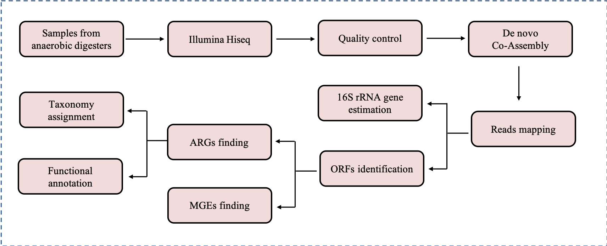
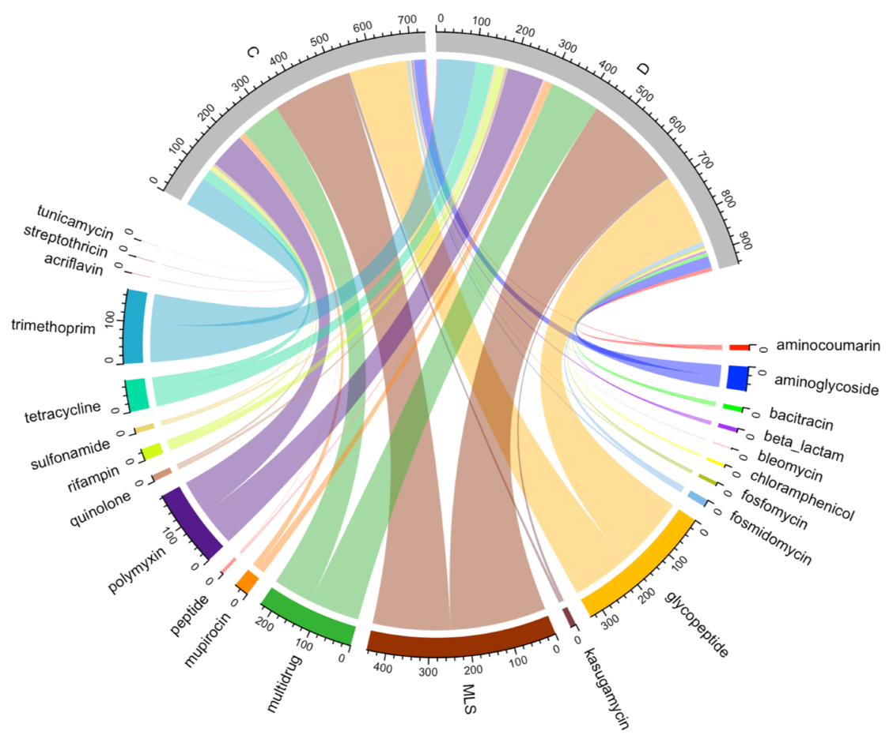
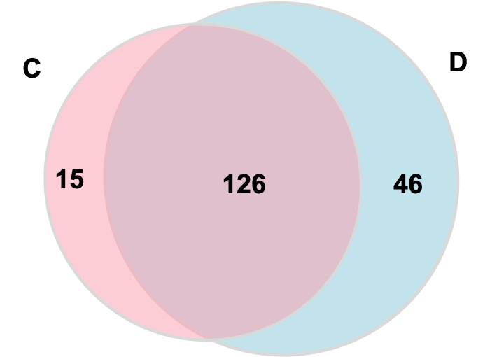
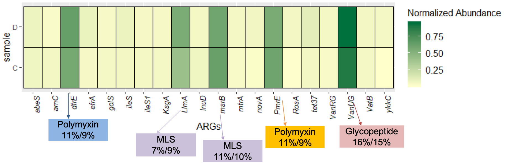
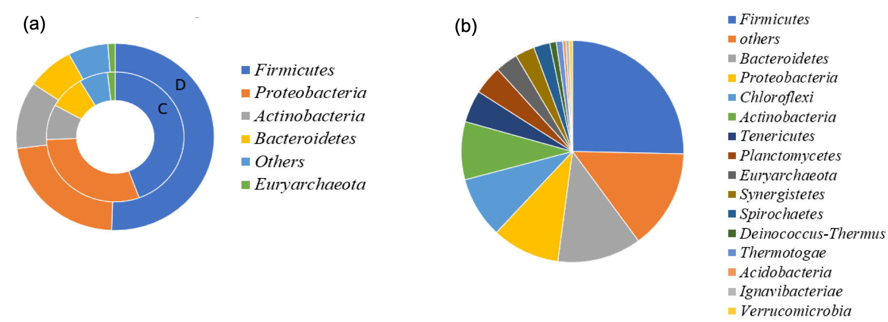
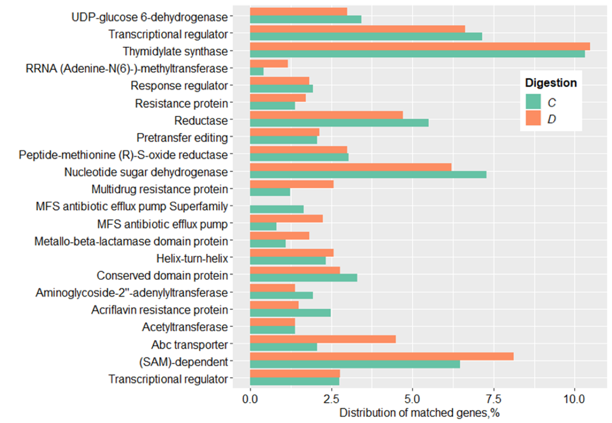
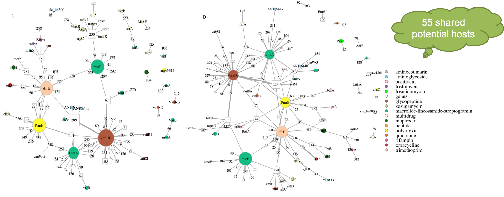

# Antibiotic-Resistant-Gene-analysis
Describe the analysis of ARGs part from WGS data 
1. General workflow of the analysis
Analysis workflow for ARGs identification on metagenomic data

2. Distributions of ARG types detected in digesters. MLS denotes macrolide-lincosamide-streptogramin. The outmost circle represents the gene number of ARG types. The length of the bars on the outer ring represented ARG gene found in two digesters (grey bars of the diagram, labeled as C and D ) and correlates the gene number of respective ARG types in the digesters(colorful bars). Each color represents an ARG type. 

3. Venn Diagram for the ARGs detected among two digesters. The number of unique ARG subtypes in C digester is 141, D digester is 172. They have 126 ARG subtypes in common, and some unique ones in their own. C represents digester C, while D is digester D.

4. Abundance of the ARGs subtypes in digester samples(the color intensity in each panel shows the ARGs/16s rRNA gene copy number, as indicators of the relative abundance of resistance genes within the bacterial population). For the visualization size limit, normalized abundance  greater than 0.2 were displayed. MLS denotes macrolide-lincosamide-streptogramin. 

5. Relative abundance of microbial community. (a) Relative consistent microbial community among the ARG carried contigs at the phylum level. The inner circle represents co-digestion samples, while the outer circle represents mono digestion samples.  (b) Microbial community of digesters.

6. Distribution of the predicted proteins in the functional class of defense mechanisms in both digestions. Metagenomic data was annotated against the eggNOG database at a cutoff of E-value < 10−5. D represents the co-digestion, while C is mono-digestion.

7. Network analysis of the correlation between ARG groups and potential taxonomical origin(ARB) in the digester samples. (The colorful circle nodes stand for various ARG groups (each color stands for one ARG category), while the white squared nodes indicate diverse microorganisms, labeled as ‘genus’ in the legend. Microorganism nodes listed were all at genus/species/strain level. The node size shows the abundance of ARGs and microorganisms. A connection represents the correlation between the ARG group and potential ARB). C stands for mon-digestion, while D stands for co-digestion.

